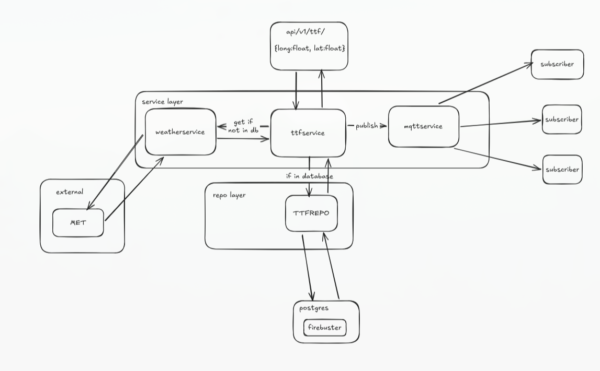

# Firebuster Peer Review Setup

## Overall architecture



## Prerequisites

- Docker
- Docker Compose
- `curl`
- `jq`

> [!IMPORTANT]
> These commands are written for macOS/Linux. Windows users may need equivalent commands.

### Extra notes for Windows
#### some dependencies must be installed explicitly
- Open PowerShell as admin
- Install Chocolatey [(Install guide)](https://chocolatey.org/install)
- Install `make` and `jq`

```
winget install jqlang.jq
```

```
choco install make
```

#### other notes
- Docker desktop must be launched separately before docker commands can be used in PowerShell.


## Setup

The stack runs four services:

- Firebuster API
- Keycloak
- PostgreSQL
- Mosquitto (MQTT broker)

Clone the repository:

```bash
git clone https://github.com/JoMag-Inc/firebuster.git
cd firebuster
```

Create `.env` from the example:

```bash
cp .env.example .env
```

Start the stack:

```bash
# Foreground
docker compose up --build

# Background
docker compose up --build -d
```

Stop the stack:

```bash
# Keep database data
docker compose down

# Remove containers and volumes (destructive)
docker compose down -v
```

## Keycloak Import Note (Important)

The realm import file is `kcdb/data/import/realm-export.json`.

Keycloak imports this file on startup when the Keycloak database is empty. If you already have data in your local volumes, old users/realm data can remain.

If you need to force a clean re-import (for example, to include the latest `tester` user), run:

```bash
docker compose down -v
docker compose up --build -d
```

## Test the API

Before testing the API we need to add the tables to the new database.
This is done through a migration script with `alembic`.

# !IMPORTANT RUN MIGRATION

To do the up migration to the latest version of the database run:

```bash
make migrate
```

this is a command we have added in Makefile, which also contains a lot of other handy commands to check the application

Test user in the current realm export:

| Username | Password   | Roles |
| -------- | ---------- | ----- |
| tester   | secrettest | ADMIN |

Get an access token:

```bash
#MacOS/Linux
token=$(curl -s -X POST "http://localhost:8080/realms/Firebuster/protocol/openid-connect/token" \
  -H "Content-Type: application/x-www-form-urlencoded" \
  -d "client_id=firebuster-api&username=tester&password=secrettest&grant_type=password" \
  | jq -r '.access_token')
```

```powershell
#Windows
$token = (curl.exe -s -X POST "http://localhost:8080/realms/Firebuster/protocol/openid-connect/token" `
  -H "Content-Type: application/x-www-form-urlencoded" `
  -d "client_id=firebuster-api&username=tester&password=secrettest&grant_type=password" `
  | ConvertFrom-Json).access_token
```

```powershell
#verify token (Windows)
Write-Host "Token: $token"
```


Quick checks:

```bash
# Public health endpoint (no auth)
curl http://localhost:8000/api/health

# Protected TTF endpoint (requires ADMIN role)
curl -s "http://localhost:8000/api/v1/ttf/?longitude=50&latitude=50" \
  -H "Authorization: Bearer $token" | jq
```

```powershell
#Windows
curl.exe http://localhost:8000/api/health

curl.exe -s "http://localhost:8000/api/v1/ttf/?longitude=50&latitude=50" `
  -H "Authorization: Bearer $token" | jq
```


## OpenAPI Docs

With the stack running, open:

```text
http://localhost:8000/docs
```

Use the token from above in the Authorize dialog, then run the protected endpoints from the UI.
It can be viewed in the terminal by typing `$token`

## MQTT

Firebuster can publish fire risk updates to MQTT whenever `GET /api/v1/ttf/` is called.

By default (from `.env.example`) it publishes to:

- Broker host: `mosquitto`
- Broker port: `1883`
- Topic: `firebuster/fire-risk`

The payload is JSON and contains:

- `event` (`fire_risk_update`)
- `source` (`fresh` when calculated now, `cache` when served from DB)
- `latitude`, `longitude`, `calculated_at`
- `ttf_points`

You can test a subscriber locally with:

```bash
docker run --rm -it --network host eclipse-mosquitto:2 \
  mosquitto_sub -h 127.0.0.1 -p 1883 -t firebuster/fire-risk -v
```

```powershell
docker run --rm -it --network host eclipse-mosquitto:2 `
  mosquitto_sub -h 127.0.0.1 -p 1883 -t firebuster/fire-risk -v
```

Then call the API endpoint and you should see a published message on the topic.

## Test with Client

We have also made a client [firebuster-explorer](https://github.com/JoMag-Inc/firebuster-explorer)
Clone and try it if you want to!
